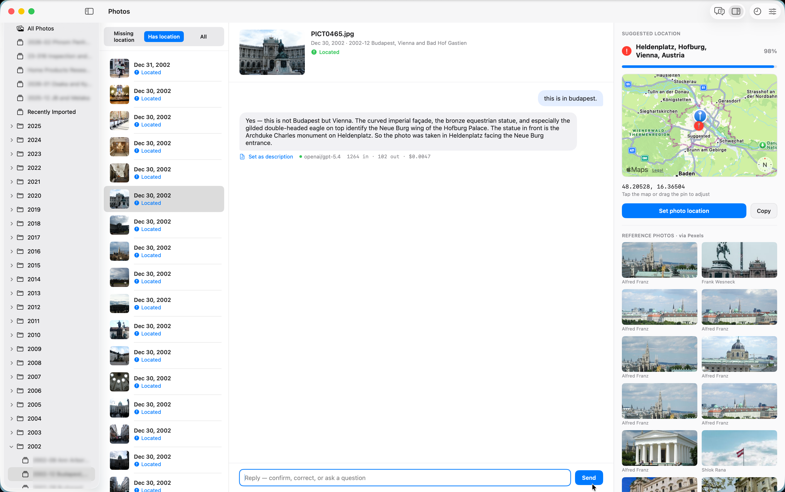

# Pinpoint

**Figure out where your undated, un-located photos were taken — by asking a vision AI — and write the location back into Apple Photos.**

Pinpoint is a macOS app that browses your Apple Photos library, sends a photo to a
vision LLM (via [OpenRouter](https://openrouter.ai)) and asks *"where was this
taken?"* — optionally with hints you type. It geocodes the answer, drops a pin on a
map, and, only when you confirm, writes the coordinates back into the photo through
PhotoKit. Every request is logged with token counts and the exact cost OpenRouter
billed you.

It's handy for scanned prints, screenshots, exports that lost their EXIF, or any
photo where you remember the place but the file forgot it.



> **Status:** early prototype (v0.1). It works and is genuinely useful, but expect
> rough edges — see [Limitations](#limitations).

## How it works

```
pick an album or folder (Photos-style tree, folders recurse)
   → filter: Missing location / Has location / All
   → select a photo (its saved location shows on the map)
   → chat with the vision model (image is attached to the first turn):
        "Where was this?" + your hints → it replies conversationally and ends
        each reply with a machine line: LOCATION: {"place_name": ..., "confidence": ...}
   → keep chatting to confirm/correct ("are you sure? could it be Plaza Mayor?")
        the app re-extracts the agreed place each turn
   → geocode place name via Apple Maps (MKLocalSearch → CLGeocoder fallback)
   → red "Suggested" pin on the map; token/cost logged per turn
   → (optional) compare against Pexels reference photos of the place
   → tap the map / drag the red pin to fine-tune
   → Set photo location → PHAssetChangeRequest writes the pin back
   → (optional) "Set as description" on any reply → writes it as the photo's
        Caption (scripts the Photos app, since PhotoKit has no caption API)
```

## Requirements

- macOS 14 (Sonoma) or later
- Xcode 15+ to build (there are no prebuilt binaries yet)
- An [OpenRouter](https://openrouter.ai/keys) API key (you pay OpenRouter per request)
- Optional: a free [Pexels](https://www.pexels.com/api/) API key for reference-photo comparison

## Building and running

1. Open the project:
   ```
   open Pinpoint.xcodeproj
   ```
   (If you add/rename files or edit `project.yml`, regenerate the project with
   [`xcodegen generate`](https://github.com/yonaskolb/XcodeGen).)

2. In Xcode, select the **Pinpoint** scheme and set your signing team under
   *Signing & Capabilities* (or let Xcode manage signing automatically for local runs).

3. Run (⌘R). On first launch macOS asks for Photos access — grant it.

4. Click the **gear** → *Provider & Model*: paste your OpenRouter key
   (`sk-or-…`, from [openrouter.ai/keys](https://openrouter.ai/keys)), then pick a
   **model family** and **model** (the list is fetched live and filtered to
   vision-capable models). The *System Prompt* tab lets you edit the instructions
   sent with every request.

5. Left column: pick an **album or folder** (or "All Photos" / a smart album).
   A folder scans every album nested under it.

6. Middle column: choose the **filter** (default *Missing location*; switch to
   *Has location* or *All* to see already-tagged photos), then pick a photo.

7. Right column: the saved location (if any) shows as a **blue pin**. Type an
   opening question/hints → **Request location from LLM**, then **keep chatting**
   to confirm or correct ("are you sure? could it be Plaza Mayor?"). Each reply
   updates the extracted place, the **red "Suggested" pin**, and the Pexels
   reference strip (if you added a key in Settings → *Reference photos*). You can
   **tap the map or drag the red pin** to fine-tune. When it looks right →
   **Set photo location**. Open the photo in Photos.app; it's on the map.

8. Each assistant reply has a **"Set as description"** button that writes that
   text to the photo's **Caption**. PhotoKit can't set captions, so this scripts
   the Photos app — the first time, macOS asks you to allow "Pinpoint → control
   Photos" (System Settings › Privacy & Security › Automation).

9. The **clock** toolbar button opens the request **history** — photo filename,
   model, result, confidence, tokens, and OpenRouter cost, with a running total.

> The model chats naturally but ends every reply with a hidden `LOCATION: {…}`
> line the app parses to drive the pin. If you edited the system prompt earlier
> (old JSON-only version), hit *Reset to default* in Settings → *System Prompt*
> to get the conversational one.

## What to know

- **Accuracy is the hard part.** The model nails famous landmarks and distinctive
  scenery; it guesses on generic interiors, close-ups, and featureless nature.
  Every result is a suggestion with a confidence score that you confirm — nothing
  is written without your click. Your hints constrain it.
- **Cost/tokens** come straight from OpenRouter (`usage: {include: true}`), so the
  history reflects what you were actually billed.
- **Your keys and photos stay on your Mac.** API keys live in local app settings;
  the only things sent off-device are the (downscaled) photo and your chat text,
  and only to the provider you configured. Nothing is written to your library
  without an explicit click.
- **Privacy on the model side.** Some models decline to pinpoint photos of
  identifiable people; landmarks, buildings, and scenery are fine.

## Project layout

| File | Role |
|------|------|
| `PinpointApp.swift` | App entry point |
| `ContentView.swift` | Three-column UI (albums → photos → detail) + `ViewModel` + map |
| `SettingsView.swift` | Provider + model family/model picker + system prompt editor |
| `HistoryView.swift` | Request log table (tokens, cost, result) |
| `AppSettings.swift` | Persisted settings + the default system prompt |
| `LLMProvider.swift` | Provider protocol + request/response types |
| `OpenRouterProvider.swift` | OpenRouter chat/completions call + model catalog fetch |
| `PexelsProvider.swift` | Reference-photo search for visual comparison |
| `LocationInference.swift` | `LocationService`: orchestrates provider call + geocoding |
| `RequestHistory.swift` | Persists the request log to Application Support |
| `PhotoLibraryService.swift` | PhotoKit: auth, album/folder tree, filtered fetch, downscale, write-back |
| `Models.swift` | Data types |
| `Info.plist` / `Pinpoint.entitlements` | Photos usage string, sandbox + network |

## Providers

Only **OpenRouter** is wired up today. Adding another provider (Anthropic-direct,
OpenAI, etc.) means conforming a new type to `LLMProvider` and extending the
provider picker in Settings — the rest of the pipeline is provider-agnostic.

## Limitations

This is a prototype. Known rough edges, roughly in priority order:

- API key lives in `UserDefaults` — it should move to the **Keychain**.
- Photo fetch caps at 200 per selected album/folder.
- No batch mode yet — one photo at a time.
- The App Sandbox is deliberately **off** (see `Pinpoint.entitlements` for why:
  sending Apple Events to Photos failed under the sandbox). That's fine for a
  personal build but would need revisiting before any kind of distribution.

Contributions and issues are welcome.

## License

[MIT](LICENSE) © 2026 Chris Drumgoole
